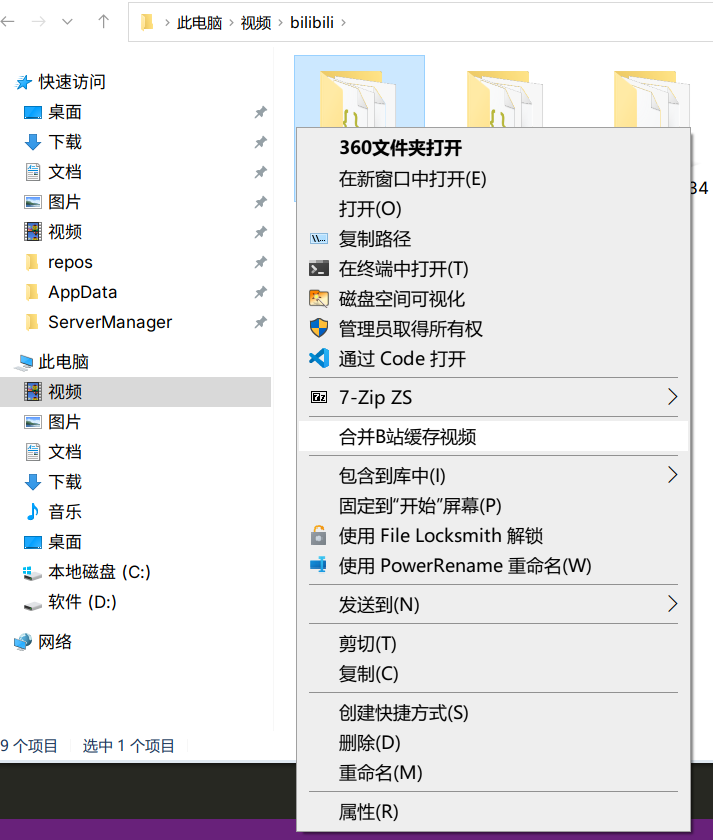

# SCM_BBVideoMerge

合并b站客户端缓存的视频（需要ffmpeg）

使用[ServerManager](https://github.com/dwmkerr/sharpshell/releases)安装程序集

程序会为缓存的视频文件夹，例如`C:\Users\Administrator\Videos\bilibili\521379`自动添加一个右键菜单。

如果你没有ffmpeg，请下载，并且添加环境变量PATH，以便于程序调用。
